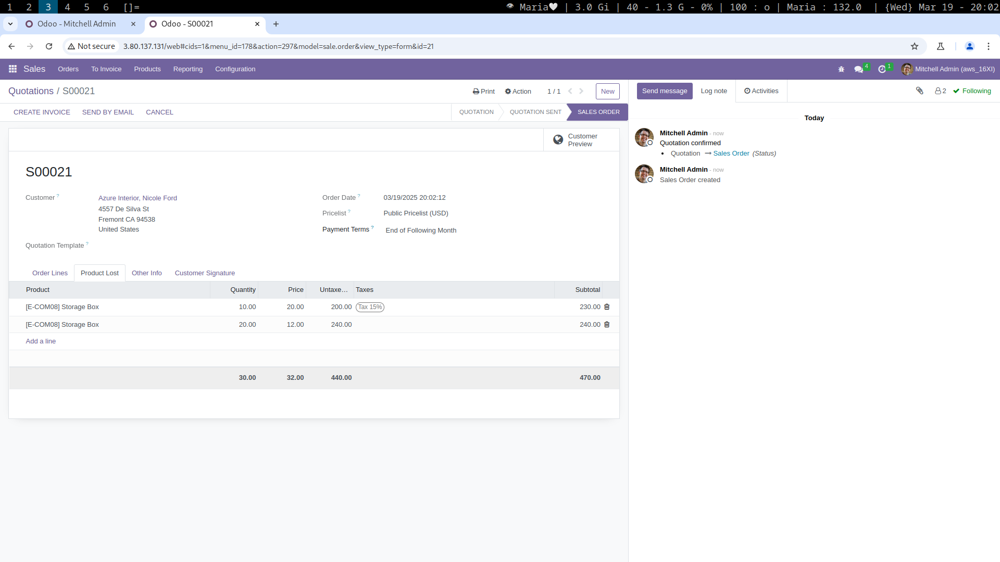
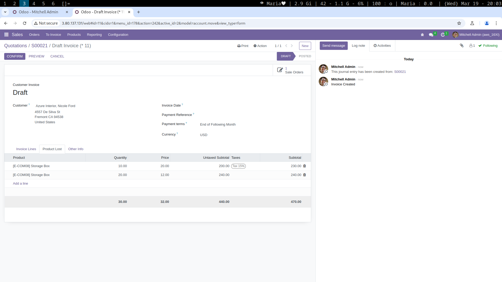
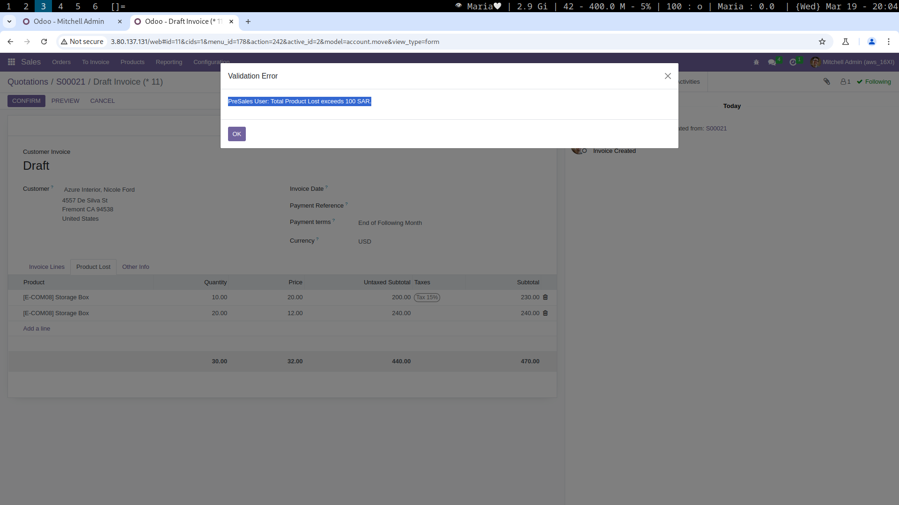

# **Sales Order Product Loss Tracker (Odoo 16)**

## **Introduction**

Welcome to the **Sales Order Product Loss Tracker** Odoo module!

This module enhances the **Sales Order** functionality by allowing businesses to track **lost or damaged products** during the sales process. It provides a dedicated section to log lost products, calculate their financial impact, and enforce approval workflows based on user roles. Additionally, it integrates with the **Customer Invoice** module to ensure accurate invoicing.

### **Features:**
- **Product Loss Tracking**: Log lost or damaged products directly in the Sales Order.
- **Financial Impact Calculation**: Automatically calculates the **untaxed amount**, **tax amount**, and **total** for lost products.
- **Role-Based Restrictions**: Restrict order confirmation based on user roles (e.g., PreSales, Sales, Sales Manager).
- **Invoice Integration**: Pass lost product data to the Customer Invoice for accurate billing.
- **Dashboard View**: Display lost product details in a structured tree view with **totals** for quantity, price, and subtotal.

### **Note:**
This module is actively developed and open to improvements. Contributions, feedback, and suggestions are highly welcome! Remember: **RTFM** (Read The F*cking Manual) and **KISS** (Keep It Simple, Stupid!).

---

## **Screenshots**

1. **Product Loss Page in Sales Order**  

   

2. **Product Loss Page in Customer Invoice**  

   

3. **Product Loss Validation**  

   


---

## **Installation**

To install the **Sales Order Product Loss Tracker** module, follow these steps:

1. **Clone the Repository:**

   Clone the `product_loss` directory into your custom addons path:

   ```bash
   git clone https://github.com/mahmoudelshimi/product_loss.git /path/to/odoo/custom/addons/
